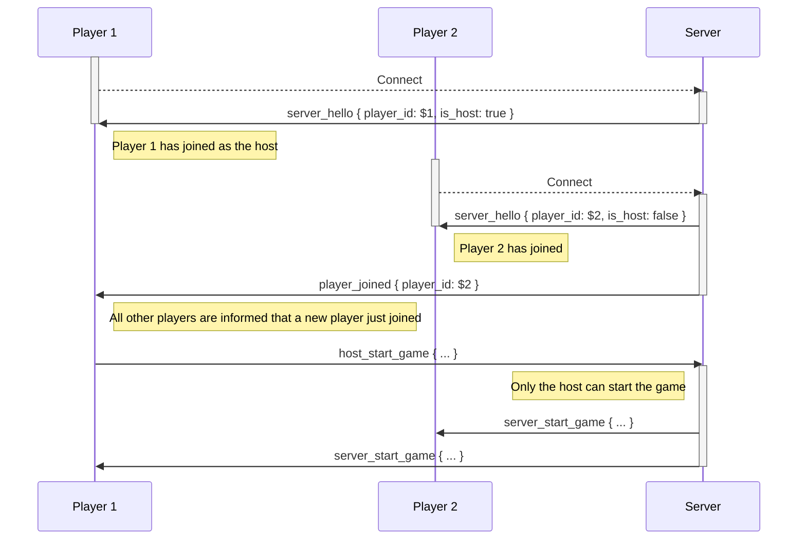
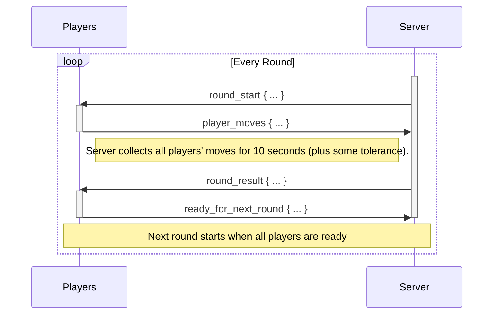

# Protocol

## Websocket Protocol

### Lobby Flow

```mermaid
sequenceDiagram
    participant p1 as Player 1
    participant p2 as Player 2
    participant server as Server
    
    activate p1
    p1-->>server: Connect
    activate server
    server->>p1: server_hello { player_id: $1, is_host: true }
    deactivate p1
    deactivate server
    note right of p1: Player 1 has joined as the host

    activate p2
    p2-->>server: Connect
    activate server
    server->>p2: server_hello { player_id: $2, is_host: false }
    deactivate p2
    note right of p2: Player 2 has joined
    server->>p1: player_joined { player_id: $2 }
    deactivate server
    note right of p1: All other players are informed that a new player just joined

    p1->>server: host_start_game { ... }
    activate server
    note left of server: Only the host can start the game
    server->>p2: server_start_game { ... }
    server->>p1: server_start_game { ... }
    deactivate server
```

### Game Loop

```mermaid
sequenceDiagram
    participant p as Players
    participant s as Server

    loop Every Round
        activate s
        s->>p: round_start { ... }
        activate p
        p->>s: player_moves { ... }
        deactivate p
        note left of s: Server collects all players' moves for 10 seconds (plus some tolerance). 
        s->>p: round_result { ... }
        activate p
        p->>s: ready_for_next_round { ... }
        deactivate p
        deactivate s
        note over p,s: Next round starts when all players are ready
    end
```
